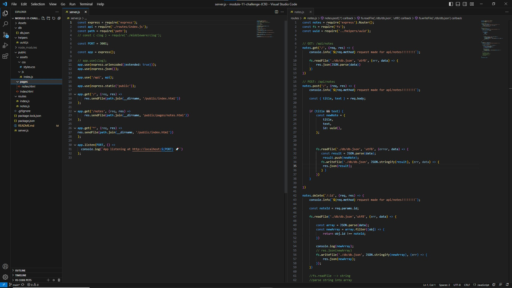

# Module-11-Challenge - Note Taker Application

## Technology Used 

| Technology Used         | Resource URL           | 
| ------------- |:-------------:| 
| HTML    | [https://developer.mozilla.org/en-US/docs/Web/HTML](https://developer.mozilla.org/en-US/docs/Web/HTML) | 
| Javascript     | [https://developer.mozilla.org/en-US/docs/Web/Javascript](https://developer.mozilla.org/en-US/docs/Web/JavaScript)      |   
| CSS     | [https://developer.mozilla.org/en-US/docs/Web/CSS](https://developer.mozilla.org/en-US/docs/Web/CSS)      | 
| Git | [https://github.com/](https://github.com/)     |    
| Node     | [https://nodejs.org/docs/latest-v20.x/api/](https://nodejs.org/docs/latest-v20.x/api/)
| Express     | [https://expressjs.com/en/guide/routing.html](https://expressjs.com/en/guide/routing.html)

## Description

We were asked to create html and api routes to improve the functionality of note taking application using express.js. The work was done almost entirely on the backend. 

We were then asked to deploy our application on Heroku. 

## Usage

1. run ~$ npm start
2. Click Get Started Button
3. Add text to input fields
4. Click save button
5. Click on note you'd like to view OR Create a new note
6. Click on the trash icon to delete a note




## User Story

```
AS A small business owner
I WANT to be able to write and save notes
SO THAT I can organize my thoughts and keep track of tasks I need to complete
```


## Acceptance Criteria

```
GIVEN a note-taking application
WHEN I open the Note Taker
THEN I am presented with a landing page with a link to a notes page
WHEN I click on the link to the notes page
THEN I am presented with a page with existing notes listed in the left-hand column, plus empty fields to enter a new note title and the note’s text in the right-hand column
WHEN I enter a new note title and the note’s text
THEN a Save icon appears in the navigation at the top of the page
WHEN I click on the Save icon
THEN the new note I have entered is saved and appears in the left-hand column with the other existing notes
WHEN I click on an existing note in the list in the left-hand column
THEN that note appears in the right-hand column
WHEN I click on the Write icon in the navigation at the top of the page
THEN I am presented with empty fields to enter a new note title and the note’s text in the right-hand column
```
## Learning Points

The purpose of this challenge was to practice creating api and html routes in the form of get requests, post requests, and delete requests, that would read, and make edits to a db.json file. 

## My Info

* [LinkedIn](https://linkedin.com/in/justinchoica)
* [Github](https://github.com/justinschoi93)
* [Email](justinschoi93@gmail.com)
